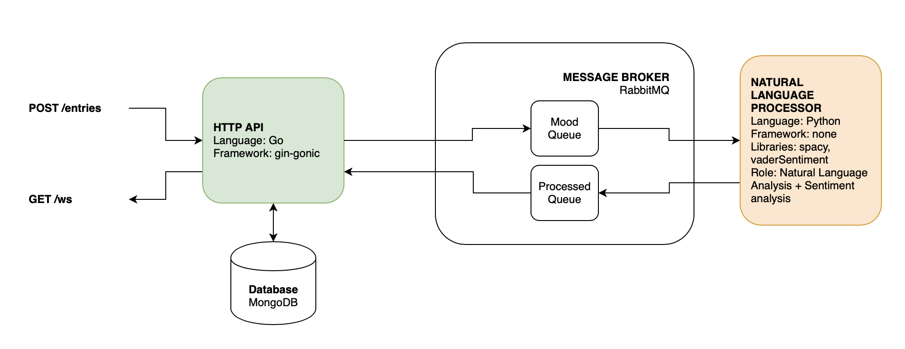

# Moood (temporary name)

## Pitch

The idea is to develop an app on which the user can simply write text, ideally on a daily basis. Some random thoughts, some feelings, but something honest and meaningful. 
Many different metadata would be extracted from the submitted text: sentiment, keywords, complexity, ... the Moood App would use that to display some arty curves and colors to express the evolution of the mood of the user. Some more advanced development could try to guess the topics which generates anxiety or happiness or life events that would suddenly change the mood.

## Installation

 ```bash
// build the docker images
make build
// run the containers
make run
```

 ## Usage

 List all Makefile rules

 ```bash
make
```

## Example

A POST HTTP request is sent to the API

```json
{
   "content": "He took a sip of the drink. He wasn't sure whether he liked it or not, but at this moment it didn't matter. She had made it especially for him so he would have forced it down even if he had absolutely hated it. That's simply the way things worked. She made him a new-fangled drink each day and he took a sip of it and smiled, saying it was excellent."
}
```

The entry is persisted in a MongoDB Collection.
A message is sent in the bus.
A JSON response is returned:

```json
{
   "id": "5f2b3b45080db76c33604694",
   "createdAt": "2020-07-14T00:41:18.618538Z",
   "content": "He took a sip of the drink. He wasn't sure whether he liked it or not, but at this moment it didn't matter. She had made it especially for him so he would have forced it down even if he had absolutely hated it. That's simply the way things worked. She made him a new-fangled drink each day and he took a sip of it and smiled, saying it was excellent."
}
```

The spacy worker process the text and enrich the JSON:

```json
{
   "id": "5f2b3b45080db76c33604694",
   "createdAt":"2020-07-14T00:41:18.618538Z",
   "content":"He took a sip of the drink. He wasn't sure whether he liked it or not, but at this moment it didn't matter. She had made it especially for him so he would have forced it down even if he had absolutely hated it. That's simply the way things worked. She made him a new-fangled drink each day and he took a sip of it and smiled, saying it was excellent.",
   "sentences":[
      {
         "sentence":"He took a sip of the drink.",
         "score":{
            "neg":0.0,
            "neu":1.0,
            "pos":0.0,
            "compound":0.0
         }
      },
      {
         "sentence":"He wasn't sure whether he liked it or not, but at this moment it didn't matter.",
         "score":{
            "neg":0.148,
            "neu":0.743,
            "pos":0.109,
            "compound":0.0793
         }
      },
      {
         "sentence":"She had made it especially for him so he would have forced it down even if he had absolutely hated it.",
         "score":{
            "neg":0.283,
            "neu":0.717,
            "pos":0.0,
            "compound":-0.8173
         }
      },
      {
         "sentence":"That's simply the way things worked.",
         "score":{
            "neg":0.0,
            "neu":1.0,
            "pos":0.0,
            "compound":0.0
         }
      },
      {
         "sentence":"She made him a new-fangled drink each day and he took a sip of it and smiled, saying it was excellent.",
         "score":{
            "neg":0.0,
            "neu":0.725,
            "pos":0.275,
            "compound":0.802
         }
      }
   ]
}
```

This data is sent back to the queue.
The API receives the processed message, update the entry in the collection and send the update entry to the user if an active websocket connection is active.

## Architecture Diagram

